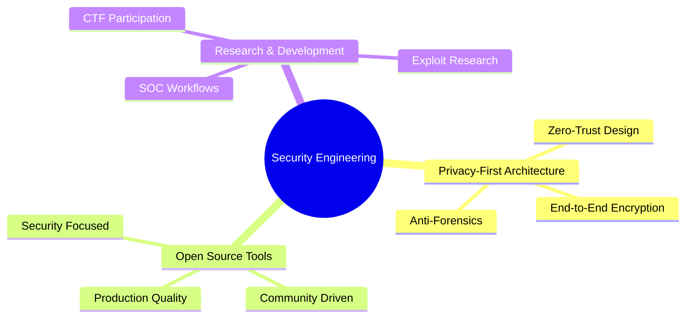

# 🛡️ Dheelep Sai Gupthaa (`dsgthor`)

<div align="center">


[](https://www.linkedin.com/in/YOUR-USERNAME)
[](mailto:dheelep@example.com)
[](https://github.com/dsgthor)

</div>

---

## 🎯 **Mission Statement**

> *"Building privacy-first, zero-trust security solutions that empower individuals and organizations to protect their digital assets in an increasingly connected world."*

**6 months** • **9 production-grade tools** • **Privacy-focused architecture** • **Open source commitment**

---

## 🔥 **Core Arsenal**

<table>
<tr>
<td width="50%">

### 🛡️ **Security & Privacy**
- 🔐 **Encryption Systems** (AES-256, Multi-layer)
- 👻 **Anti-forensics & Stealth**
- 🧱 **Zero-trust Architecture**
- 🔄 **P2P Secure Communications**

</td>
<td width="50%">

### ⚡ **Technical Stack**
- 🐍 **Python** (Flask, FastAPI, Asyncio)
- 🌐 **WebRTC & Real-time Systems**
- 🖥️ **System Programming** (Bash, CLI)
- 🔍 **SIEM & Monitoring**

</td>
</tr>
</table>

---

## 🚀 **Featured Projects**

<details open>
<summary><b>🔄 DirectDrop - Secure P2P File Transfer</b></summary>

```
🎯 Purpose: Zero-knowledge file sharing with end-to-end encryption
🛠️ Tech: WebRTC, FastAPI, AES-256
⭐ Features: No server storage, perfect forward secrecy, real-time transfer
```
[](https://github.com/dsgthor/DirectDrop)
[](https://github.com/dsgthor/DirectDrop)

</details>

<details>
<summary><b>📊 Mini_SIEM - Lightweight Security Monitoring</b></summary>

```
🎯 Purpose: Real-time threat detection and incident response
🛠️ Tech: Python, Flask, SQLite, WebSocket
⭐ Features: Live dashboard, behavioral baselining, custom alerts
```
[](https://github.com/dsgthor/Mini_siem)
[](https://github.com/dsgthor/Mini_siem)

</details>

<details>
<summary><b>👻 GhostIP - Automated IP Anonymization</b></summary>

```
🎯 Purpose: Dynamic IP rotation for privacy and security
🛠️ Tech: Python, Proxy Integration, Geo-IP
⭐ Features: Auto proxy scraping, location spoofing, stealth mode
```
[](https://github.com/dsgthor/GhostIP_IPchanger)
[](https://github.com/dsgthor/GhostIP_IPchanger)

</details>

<details>
<summary><b>🧨 Vajra - Military-Grade File Shredder</b></summary>

```
🎯 Purpose: Secure data destruction with anti-recovery measures
🛠️ Tech: AES-256, DoD 5220.22-M, Gutmann Method
⭐ Features: GUI/CLI, panic mode, forensic resistance
```
[](https://github.com/dsgthor/Vajra)
[](https://github.com/dsgthor/Vajra)

</details>

<details>
<summary><b>🔐 Nirvaktra - Dead Man's Switch</b></summary>

```
🎯 Purpose: Time-locked secret management with dual encryption
🛠️ Tech: AES-256, RSA, Automated Triggers
⭐ Features: Keyhole v2, emergency protocols, secure inheritance
```
[](https://github.com/dsgthor/Nirvaktra)
[](https://github.com/dsgthor/Nirvaktra)

</details>

<details>
<summary><b>💾 Demigod_server - Secure Terminal Server</b></summary>

```
🎯 Purpose: Hardened file server with advanced protection
🛠️ Tech: Flask, QR Authentication, Rate Limiting
⭐ Features: Brute-force protection, terminal UI, mobile QR login
```
[](https://github.com/dsgthor/Demigod_server)
[](https://github.com/dsgthor/Demigod_server)

</details>

### 🛠️ **Additional Tools**

| Tool | Description | Key Features |
|------|-------------|--------------|
| 🎮 [**Anti-afk**](https://github.com/dsgthor/Anti-afk) | Stealth automation with human-like patterns | Undetectable, randomized behavior |
| 🔑 [**Tricrypt**](https://github.com/dsgthor/Tricrypt) | Lightweight CLI encryption utility | Fast, portable, secure |
| 🧙 [**Rahastra**](https://github.com/dsgthor/Rahastra) | Interactive terminal logic puzzle | Security-minded game design |

---

## 📈 **Development Metrics**

<div align="center">


</div>

---

## 🏆 **Expertise Matrix**

<table>
<tr>
<td>

**🔒 Security Engineering**
- Cryptographic implementations
- Vulnerability assessment
- Secure code review
- Incident response

</td>
<td>

**🛡️ Privacy Technology**
- Zero-knowledge architectures
- Anonymous communications
- Anti-surveillance systems
- Data sovereignty

</td>
<td>

**⚔️ Offensive Security**
- CTF competitions
- Exploit development
- Red team operations
- Security research

</td>
</tr>
</table>

---

## 🎯 **Current Focus Areas**



---

## 🌟 **Philosophy**

> **"Security is not a product, but a process. Privacy is not about hiding; it's about freedom."**

- 🧱 **Privacy by Design**: Every tool built with privacy as the foundation
- 🔓 **Open Source Commitment**: Transparency builds trust
- ⚡ **Performance Matters**: Security shouldn't compromise usability
- 🎯 **Real-World Impact**: Solving actual problems, not academic exercises

---

## 📫 **Connect & Collaborate**

<div align="center">

[](https://www.linkedin.com/in/YOUR-USERNAME)
[](link-to-resume-if-you-want)
[](mailto:dheelep@example.com)

**🤝 Open to collaborations in cybersecurity research, privacy technology, and open-source security tools**

---

*⚡ "Building the future of digital privacy, one commit at a time" ⚡*

</div>
